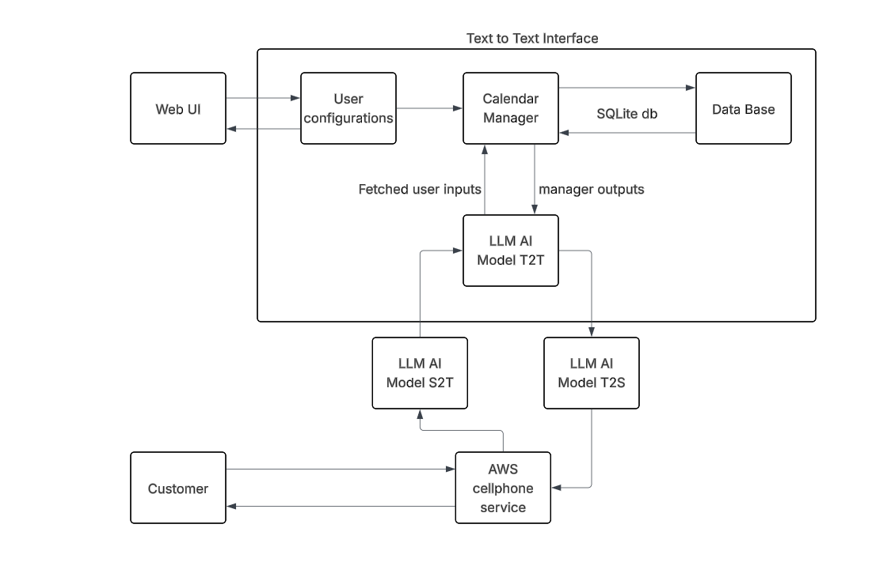

## Smart-Front-Desk
Are you looking for someone to take over your phone call services at a 24/7 tier? Well, good news: a smart front desk service AI, powered by OpenAI, is capable of handling most of the work. With a smart front desk, you can be free from all trivial phone call services and emphasize valuable services to your customers, raising your service quality to the next level of excellence.

This is an LLM-based phone customer service desk project. We provide an AI-powered front desk clerk who will be able to respond to customers by answering and scheduling appointments based on our shop database. This version is based on the OpenAI model; a much lighter-weighted AI will be developed later on.

If you find this work useful in your research, please cite us.

## Features
- **Phone operation**
    - The Smart-Front-Desk can help you answer the phone, providing customer service with a smooth, human-like voice tone.
- **Service introduction & policy review**
  - The Smart-Front-Desk can help customers with orientations and policy reviews.
- **Appointment setup and cancellation**
  - The Smart-Front-Desk can arrange the appointment, ensuring a good schedule for both the shopkeeper and the customer. 
- **Cutoff recovery**
    - The customer can cut off AI's speech and speak to it.

## Guides
**There are three branches available for the experiment**
The main branch is the most straightforward one; this version requires no text-to-speech or speech-to-text module and uses the terminal to experiment with the major function. 

Version 1.20 and 1.30 require the VOSK model

## Setup Instructions
The best way to set up on Windows is using Visual Studio Code
1. Install the Python library

This project is still under development, and not all features are currently available.
